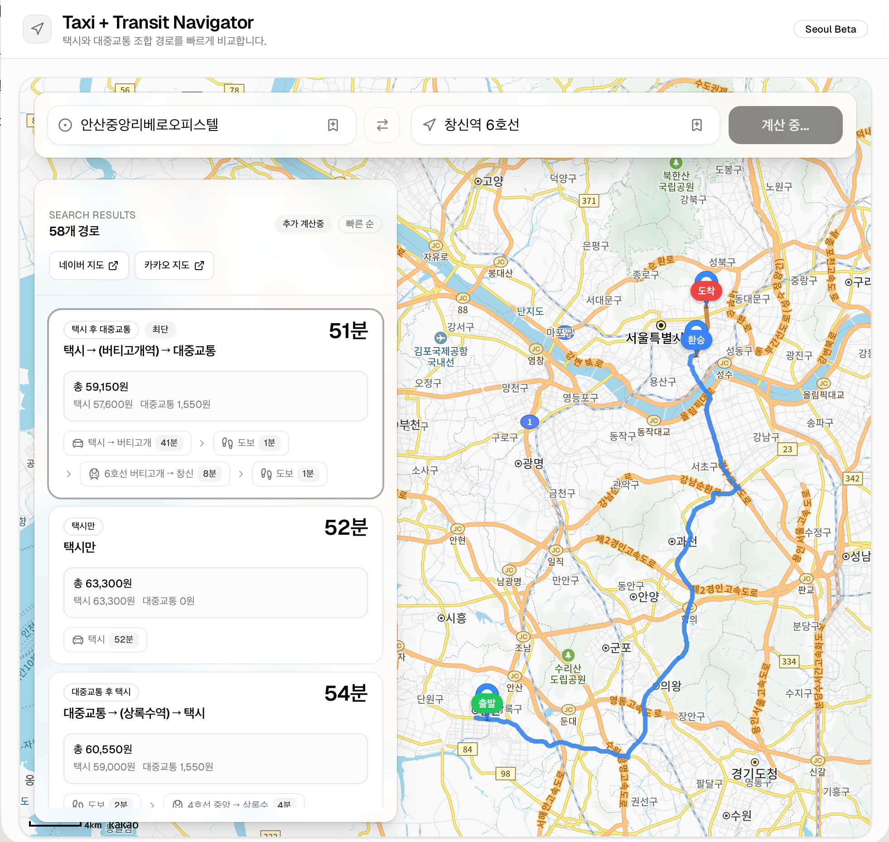

# 🚕 택시 + 대중교통 최적 경로

일반 지도 앱에서 제공하지 않는 **택시 ↔ 대중교통 조합 경로**를 계산해 가장 빠른 이동 방법을 찾아주는 웹앱입니다.

## 스크린샷



## 기능

- 출발지/도착지 입력 시 자동완성 (Kakao Local API)
- 순수 택시, 순수 대중교통 경로 비교
- **택시 → 대중교통** 조합 (중간 역/정류장까지 택시)
- **대중교통 → 택시** 조합 (중간 역/정류장에서 택시)
- 결과를 소요 시간 기준 오름차순 정렬
- Kakao 지도에 선택 경로 시각화

## 기술 스택

- React + Vite
- Kakao Maps JavaScript SDK (지도 렌더링)
- Kakao Mobility REST API (택시 경로)
- Kakao Local REST API (장소 검색)
- Odsay API (대중교통 경로)

## 필요 API 키

| 변수 | 발급처 | 설명 |
|------|--------|------|
| `VITE_KAKAO_JS_APP_KEY` | [developers.kakao.com](https://developers.kakao.com/console/app) | 내 애플리케이션 > 앱 키 > JavaScript 키 |
| `VITE_KAKAO_REST_API_KEY` | [developers.kakao.com](https://developers.kakao.com/console/app) | 내 애플리케이션 > 앱 키 > REST API 키 |
| `VITE_ODSAY_API_KEY` | [lab.odsay.com](https://lab.odsay.com/guide/guide#guideWeb_1) | 회원가입 후 마이페이지 > API 키 관리 |

### Kakao 추가 설정 (앱 생성 후)

1. **지도 서비스 활성화**
   [내 애플리케이션](https://developers.kakao.com/console/app) > 앱 선택 > **제품 설정 > 카카오맵** > 활성화

2. **JS SDK 도메인 등록** (지도 렌더링 허용)
   [내 애플리케이션](https://developers.kakao.com/console/app) > 앱 선택 > **플랫폼 키 > JavaScript 키 > JS SDK 도메인**
   → 실행 환경의 도메인/포트 추가 (예: `http://localhost:5173`, `https://your-domain.com`)

### Odsay 추가 설정 (키 발급 후)

**Service URI 등록** (도메인 인증)
[마이페이지 > API 키 관리](https://lab.odsay.com/guide/guide#guideWeb_1) > 해당 키 > Service URI
→ 실행 환경의 도메인/포트 추가 (예: `http://localhost:5173`, `https://your-domain.com`)

> Odsay는 포트 번호까지 정확히 일치해야 인증됩니다.

## 실행 방법

### 로컬 개발

```bash
cp .env.example .env   # API 키 입력
npm install
npm run dev            # http://localhost:5173
```

### Docker

```bash
docker build \
  --build-arg VITE_KAKAO_JS_APP_KEY=your_js_key \
  --build-arg VITE_KAKAO_REST_API_KEY=your_rest_key \
  --build-arg VITE_ODSAY_API_KEY=your_odsay_key \
  -t taxi-subway-map .

docker run -p 8080:80 taxi-subway-map
# http://localhost:8080
```

### 프로덕션 빌드

```bash
npm run build   # dist/ 폴더 생성
```

정적 파일(`dist/`)을 nginx, Apache, S3+CloudFront 등 어디든 호스팅 가능합니다.
